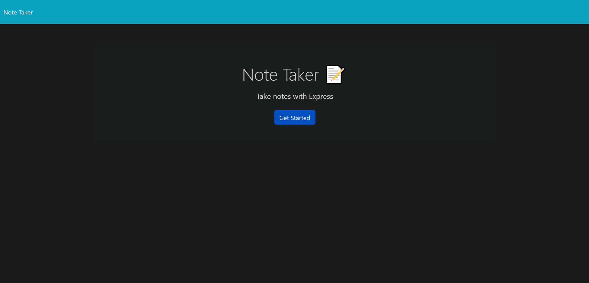
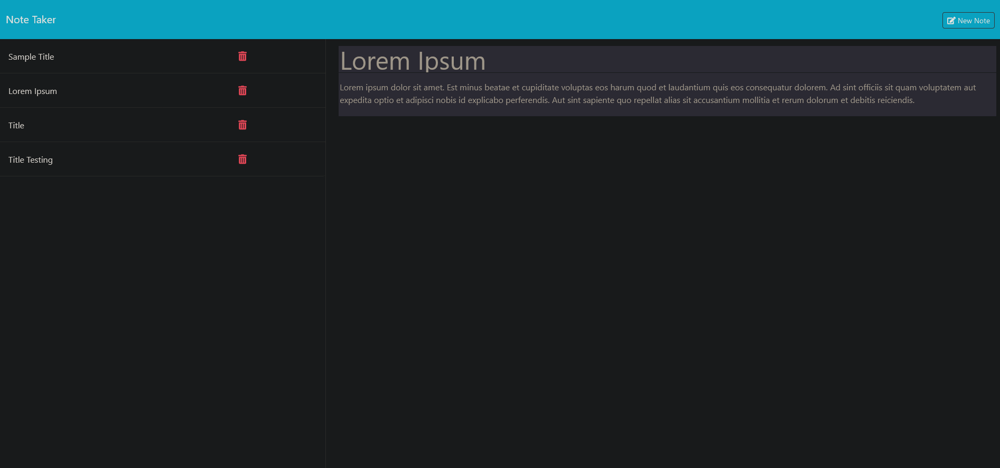

# NoteTaker

  ## Description

  The purpose of this project is to have a note-taking application which allows me to save, review and delete notes from a single location

  

  

  Link to deployed app: https://immense-atoll-95398-dc6d207cef29.herokuapp.com/
  
  Link to Project: https://russellbooth.github.io/NoteTaker/

  ## Table of Contents

  - [Installation](#installation)
  - [Usage](#usage)
  - [Credits](#credits)
  - [License](#license)

  ## Installation

  NodeJS is required to run the program, as well as the fs, express, and path built-in functionalities of javascript.

  ## Usage

  The instructions for use is to run 'node server.js' in the terminal then run the application on localhost:3001 (or the accessible port found). The taken notes appear on the left hand side of the screen and the right side is where titles for notes, and the body of the notes are entered. The notes are saved using the save note button at the top of the screen, as well as a button to clear the form if the note is not entered in correctly.

  ## License

  MIT License

  

  

  MIT License

    Copyright (c) [2024] [Russell Booth]
    
    Permission is hereby granted, free of charge, to any person obtaining a copy
    of this software and associated documentation files (the "Software"), to deal
    in the Software without restriction, including without limitation the rights
    to use, copy, modify, merge, publish, distribute, sublicense, and/or sell
    copies of the Software, and to permit persons to whom the Software is
    furnished to do so, subject to the following conditions:
    
    The above copyright notice and this permission notice shall be included in all
    copies or substantial portions of the Software.
    
    THE SOFTWARE IS PROVIDED "AS IS", WITHOUT WARRANTY OF ANY KIND, EXPRESS OR
    IMPLIED, INCLUDING BUT NOT LIMITED TO THE WARRANTIES OF MERCHANTABILITY,
    FITNESS FOR A PARTICULAR PURPOSE AND NONINFRINGEMENT. IN NO EVENT SHALL THE
    AUTHORS OR COPYRIGHT HOLDERS BE LIABLE FOR ANY CLAIM, DAMAGES OR OTHER
    LIABILITY, WHETHER IN AN ACTION OF CONTRACT, TORT OR OTHERWISE, ARISING FROM,
    OUT OF OR IN CONNECTION WITH THE SOFTWARE OR THE USE OR OTHER DEALINGS IN THE
    SOFTWARE.

  ## Contributing
  
  ## Tests

  ## Questions

  If you have any questions feel free to reach out and contact me via email at: russellbooth121@gmail.com.
  Or follow other projects on GitHub at https://github.com/RussellBooth.

  ## Acknowledgments/Credits

    The UC Davis Coding Bootcamp. For hosting an amazing program with very dedicated staff and support
    The started code used in this program was provided by the UC Davis Coding Bootcamp, in which was built off to build a functional program.
    My wonderful instructor and TA, Alex Kauffman and Zach Warner.
